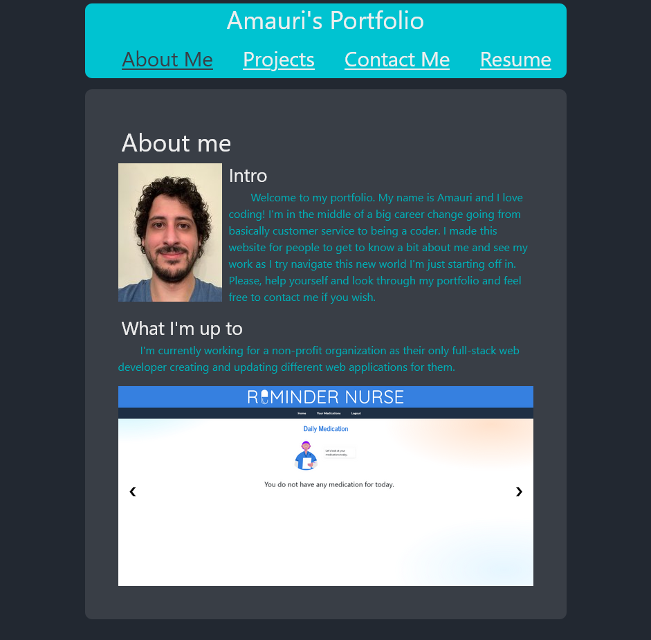

# Portfolio

## Description

I build this project using React so I can showcase my web projects to potential employers when looking for a part-time or full time job. Showing my skills and talents as a web developer. It has a short about me page, a portfolio page with a few of the projects I've worked on or created, a contact page where you can send me an email and a resume page with list of my skills and a link to download my resume.

## Installation

- Have Nodejs installed (I used v16.18)
- Install npm dependencies
  - use 'npm install' on terminal once navigated to folder

## Usage

Navigate to the root directory on your terminal then run the application with "npm start". You can then visit the application in your browser through "localhost:3000". Alternatively you can visit the [working application here](https://nicolasflamel.github.io/portfolio/).

## Credits

N/A

## License

N/A